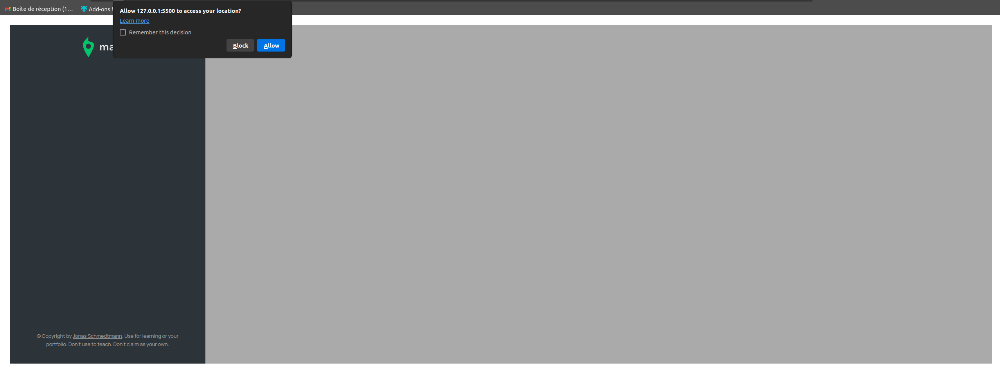
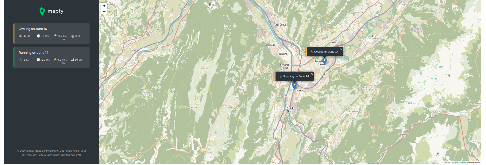

# mapty
Mapty project from the JavaScript course offered by Jonas Schmedtmann. As a Mapty user, this project allows you to display your workouts on a map using the Leaflet library.

# Allow to acces to yout location

# Different activities

